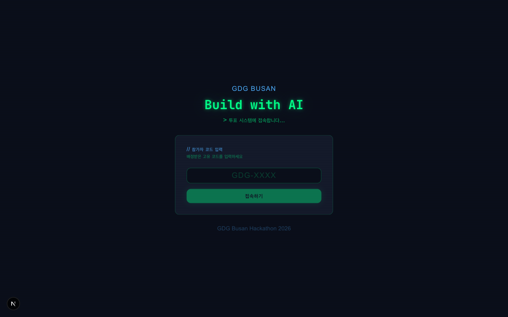
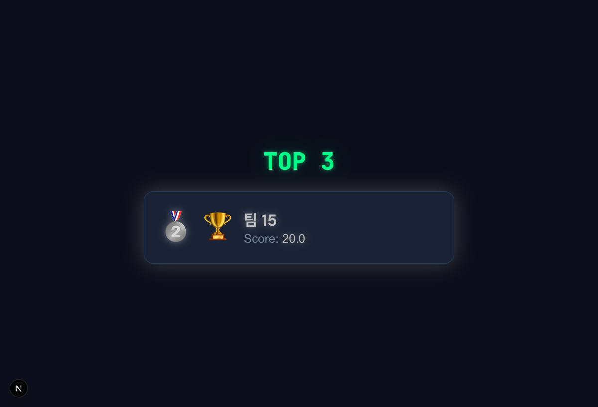
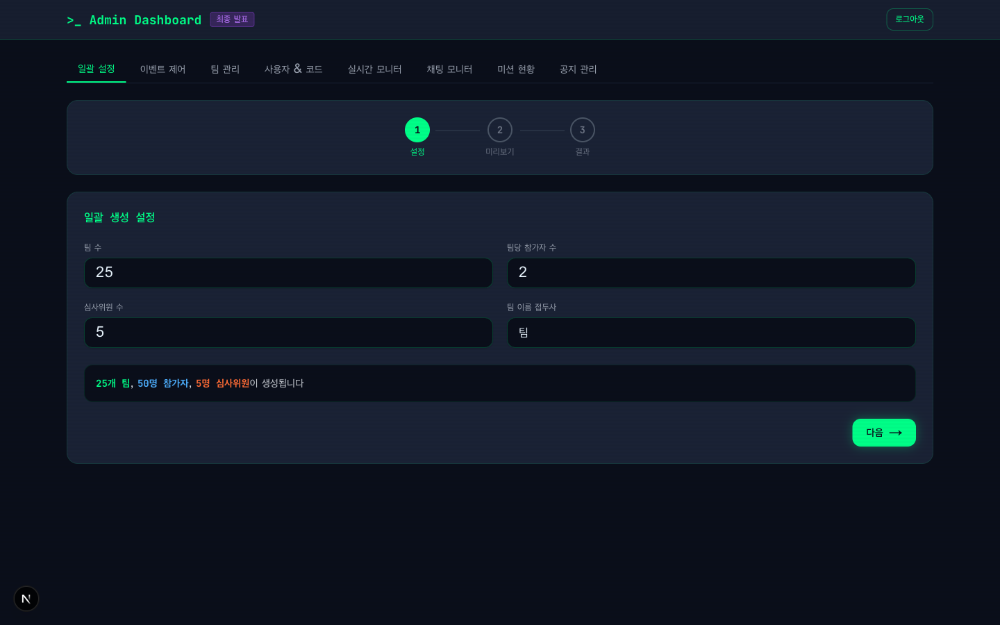

<div align="center">

```
  ██████╗ ██████╗  ██████╗     ██████╗ ██╗   ██╗███████╗ █████╗ ███╗   ██╗
 ██╔════╝ ██╔══██╗██╔════╝     ██╔══██╗██║   ██║██╔════╝██╔══██╗████╗  ██║
 ██║  ███╗██║  ██║██║  ███╗    ██████╔╝██║   ██║███████╗███████║██╔██╗ ██║
 ██║   ██║██║  ██║██║   ██║    ██╔══██╗██║   ██║╚════██║██╔══██║██║╚██╗██║
 ╚██████╔╝██████╔╝╚██████╔╝    ██████╔╝╚██████╔╝███████║██║  ██║██║ ╚████║
  ╚═════╝ ╚═════╝  ╚═════╝     ╚═════╝  ╚═════╝ ╚══════╝╚═╝  ╚═╝╚═╝  ╚═══╝
```

# Build with AI Hackathon 2026

### Real-time Voting Platform

**25 Teams &bull; 50 Participants &bull; Live Results**

[](https://nextjs.org/)
[](https://react.dev/)
[](https://firebase.google.com/)
[](https://www.typescriptlang.org/)
[](https://tailwindcss.com/)

[](./LICENSE)
[](https://makeapullrequest.com)

<br />

> *GDG Busan "Build with AI" 해커톤을 위한 실시간 투표 플랫폼.*
> *심사위원과 참가자의 가중 투표로 TOP 10을 선정합니다.*

<br />

</div>

---

## Screenshots

<table>
<tr>
<td align="center" width="33%">
<strong>Login</strong><br/>

</td>
<td align="center" width="33%">
<strong>Vote</strong><br/>

</td>
<td align="center" width="33%">
<strong>Results</strong><br/>

</td>
</tr>
<tr>
<td align="center" colspan="3">
<strong>Admin Dashboard</strong><br/>

</td>
</tr>
</table>

---

## Overview

GDG Busan 해커톤에서 25개 팀(2인 1팀, 50명)의 프로젝트를 심사위원과 참가자가 함께 평가하는 **실시간 투표 시스템**입니다.

```
┌─────────────────────────────────────────────────────────┐
│                                                         │
│   참가자 코드 입력  →  실시간 투표  →  드라마틱 결과 공개   │
│   (P001, J001)        (최대 N팀)      (카운트다운 연출)    │
│                                                         │
└─────────────────────────────────────────────────────────┘
```

### Why This Project?

- **공정한 평가** — 심사위원+참가자 가중 점수로 편향 최소화
- **실시간 반영** — Firestore `onSnapshot`으로 투표 즉시 반영
- **부정 방지** — 4중 검증 (클라이언트 UI → Firestore Rules → API → Admin)
- **드라마틱 연출** — 카운트다운 + 순차 공개로 해커톤 분위기 극대화

---

## Design: "Living Terminal"

> 터미널에서 영감을 받은 다크 테마. 해커톤의 개발자 감성을 극대화합니다.

```
┌─────────────────────────────────────────────┐
│  Color Palette                              │
│                                             │
│  ██ #0A0E1A  Background (Deep Space)        │
│  ██ #00FF88  Terminal Green (Primary)       │
│  ██ #4DAFFF  AI Blue (Accent)              │
│  ██ #FF6B35  Orange (Warning/Highlight)    │
│                                             │
│  Font: JetBrains Mono + DM Sans            │
│  Effects: Glow, Scanline, Dot-grid, Cursor │
└─────────────────────────────────────────────┘
```

---

## Features

<table>
<tr>
<td width="50%">

### Voting System
- 참가자/심사위원 가중 투표
- 최대 N팀 선택 (설정 가능)
- 자기 팀 투표 자동 차단
- Firestore batch write 원자적 처리

</td>
<td width="50%">

### Real-time Updates
- 모든 페이지 실시간 동기화
- 투표 진행률 즉시 반영
- 팀 정보 변경 즉시 표시
- 관리자 상태 전환 즉시 적용

</td>
</tr>
<tr>
<td width="50%">

### Team Inspect Sheet
- `$ inspect --team="팀명"` 터미널 테마
- Drawer Sheet UI로 상세 정보 확인
- 멤버 프로필 (이름 + 소개)
- Sheet 내 투표 버튼 지원

</td>
<td width="50%">

### Dramatic Results
- 카운트다운 타이머 연출
- TOP 10 순차 공개 애니메이션
- 정규화 가중 점수 계산
- Confetti 축하 효과

</td>
</tr>
</table>

---

## Architecture

```
┌──────────────┐     ┌──────────────┐     ┌──────────────────┐
│   Browser    │────▶│  Next.js 16  │────▶│  Firebase Admin   │
│  (React 19)  │     │  API Routes  │     │     SDK           │
└──────┬───────┘     └──────────────┘     └────────┬─────────┘
       │                                           │
       │  onSnapshot (실시간)                       │  Custom Token
       │                                           │
       ▼                                           ▼
┌──────────────────────────────────────────────────────────┐
│                    Cloud Firestore                       │
│                                                          │
│  events/{eventId}                                        │
│    ├── teams/{teamId}     # 팀 정보 + 투표 카운트          │
│    ├── users/{uniqueCode} # 사용자 정보 + 투표 상태        │
│    └── votes/{voterId}    # 투표 기록                     │
└──────────────────────────────────────────────────────────┘
```

### Authentication Flow

```
사용자 코드 입력 (P001)
       │
       ▼
  /api/auth → Firestore users 조회
       │
       ▼
  Custom Token 발급 (role, teamId, name)
       │
       ▼
  signInWithCustomToken() → 클라이언트 인증 완료
```

### Scoring Formula

```
finalScore = (judgeNormalized × judgeWeight) + (participantNormalized × participantWeight)

  where normalized = (teamVotes / maxVotesInGroup) × 100
```

---

## Pages

| Route | Description | Auth |
|-------|------------|------|
| `/` | 코드 입력 로그인 (Terminal UI) | - |
| `/vote` | 팀 목록 + 투표 + 팀 상세 보기 | Participant / Judge |
| `/admin` | 이벤트/팀/유저 관리 대시보드 | Admin |
| `/results` | 결과 공개 (드라마틱 연출) | All |

---

## Quick Start

### Prerequisites

- **Node.js** 18+
- **pnpm** (recommended) or npm
- **Firebase** project with Firestore enabled

### 1. Clone & Install

```bash
git clone https://github.com/gdg-busan/2026-Build-with-AI-Hackaton-in-Busan.git
cd 2026-Build-with-AI-Hackaton-in-Busan
pnpm install
```

### 2. Environment Setup

```bash
cp .env.local.example .env.local
```

Fill in your Firebase credentials:

| Variable | Description |
|----------|------------|
| `NEXT_PUBLIC_FIREBASE_*` (6) | Firebase Client SDK config |
| `FIREBASE_PROJECT_ID` | Firebase project ID |
| `FIREBASE_CLIENT_EMAIL` | Service account email |
| `FIREBASE_PRIVATE_KEY` | Service account key (**must be wrapped in double quotes**) |
| `NEXT_PUBLIC_EVENT_ID` | Event ID (default: `gdg-busan-2026`) |

### 3. Seed & Run

```bash
# Create initial admin user & event
npx tsx scripts/seed-admin.ts

# Start development server
pnpm dev
```

Open [http://localhost:3000](http://localhost:3000)

---

## API Routes

| Method | Route | Description |
|--------|-------|------------|
| `POST` | `/api/auth` | Code-based login (Custom Token) |
| `POST` | `/api/vote` | Submit votes |
| `PUT` | `/api/team` | Update team info |
| `PUT` | `/api/user` | Update profile (name, bio) |
| `POST` | `/api/admin` | Admin actions (event/team/user mgmt) |

---

## Testing

```bash
# Unit tests
npx vitest

# E2E tests (requires dev server running)
pnpm dev &
npx playwright test
```

---

## Tech Stack

| Layer | Technology |
|-------|-----------|
| Framework | [Next.js 16](https://nextjs.org/) (App Router) |
| UI Library | [React 19](https://react.dev/) |
| Language | [TypeScript 5](https://www.typescriptlang.org/) |
| Database | [Cloud Firestore](https://firebase.google.com/docs/firestore) (Realtime) |
| Auth | [Firebase Auth](https://firebase.google.com/docs/auth) (Custom Token) |
| Styling | [Tailwind CSS v4](https://tailwindcss.com/) + [shadcn/ui](https://ui.shadcn.com/) |
| Animation | [Framer Motion](https://www.framer.com/motion/) + [canvas-confetti](https://github.com/catdad/canvas-confetti) |
| Testing | [Vitest](https://vitest.dev/) + [Playwright](https://playwright.dev/) |

---

## Event Status Flow

```
  waiting ──▶ voting ──▶ closed ──▶ revealed
     ▲           │          │          │
     └───────────┴──────────┴──────────┘
              (Admin can freely switch)
```

---

## Contributing

Contributions are welcome! Feel free to open issues and pull requests.

1. Fork the repository
2. Create your feature branch (`git checkout -b feature/amazing-feature`)
3. Commit your changes (`git commit -m 'Add amazing feature'`)
4. Push to the branch (`git push origin feature/amazing-feature`)
5. Open a Pull Request

---

## License

This project is licensed under the MIT License - see the [LICENSE](./LICENSE) file for details.

---

<div align="center">

**Built with** ❤️ **by [GDG Busan](https://gdg.community.dev/gdg-busan/)**

*Made for the GDG Busan "Build with AI" Hackathon 2026*

[](https://gdg.community.dev/gdg-busan/)

</div>
